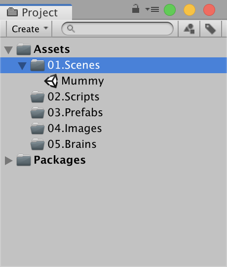
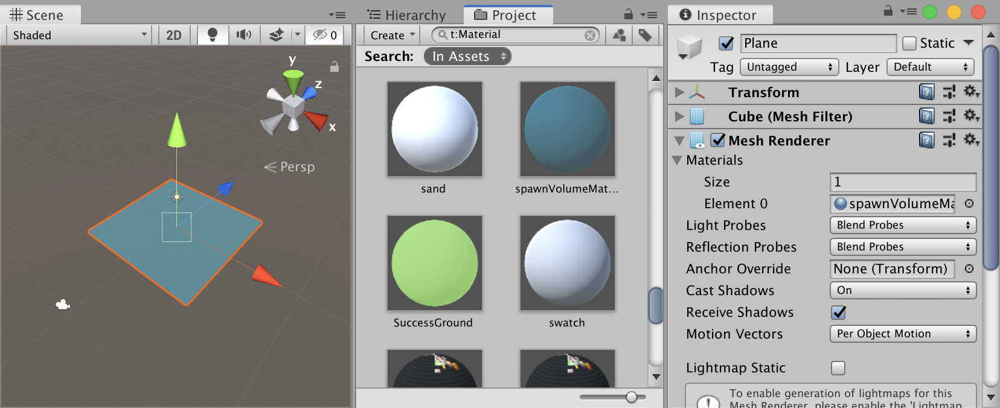
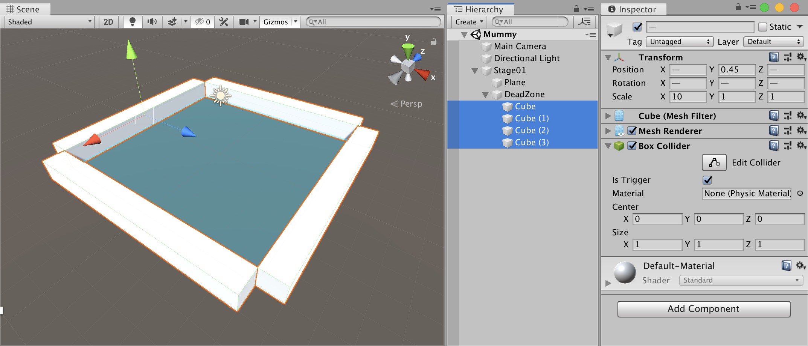
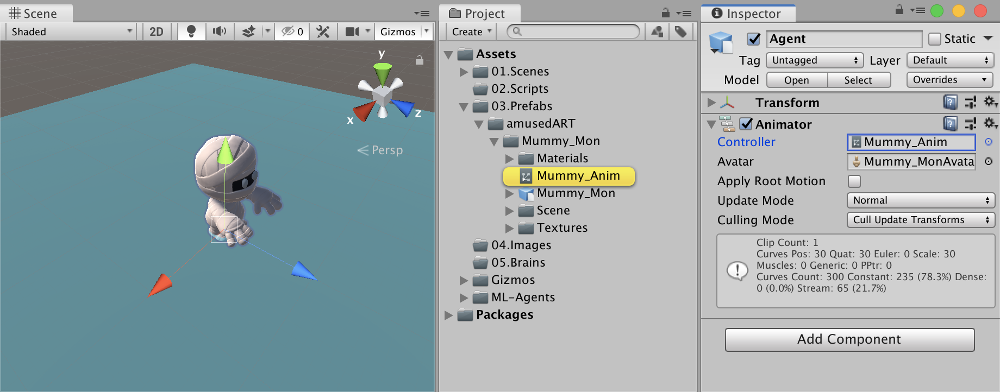
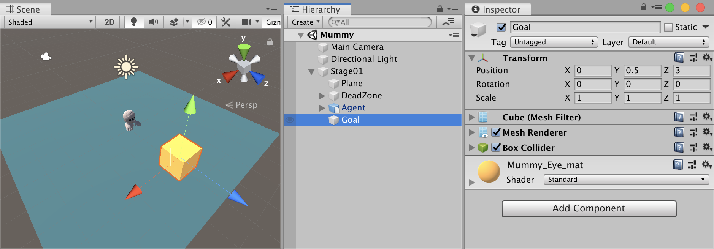
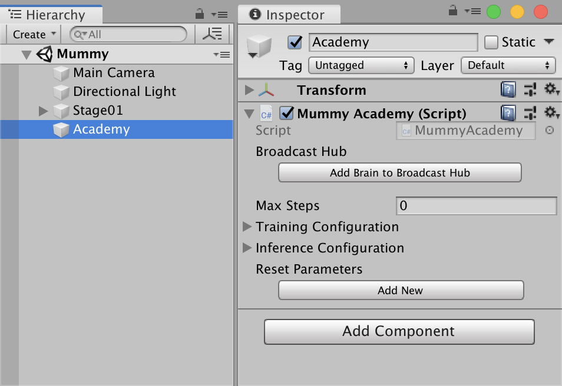
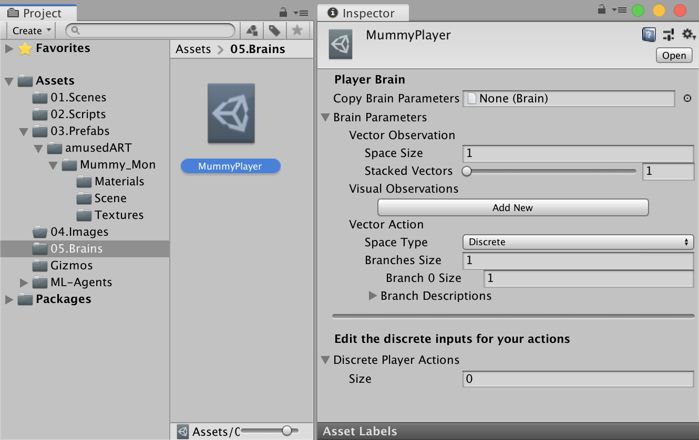
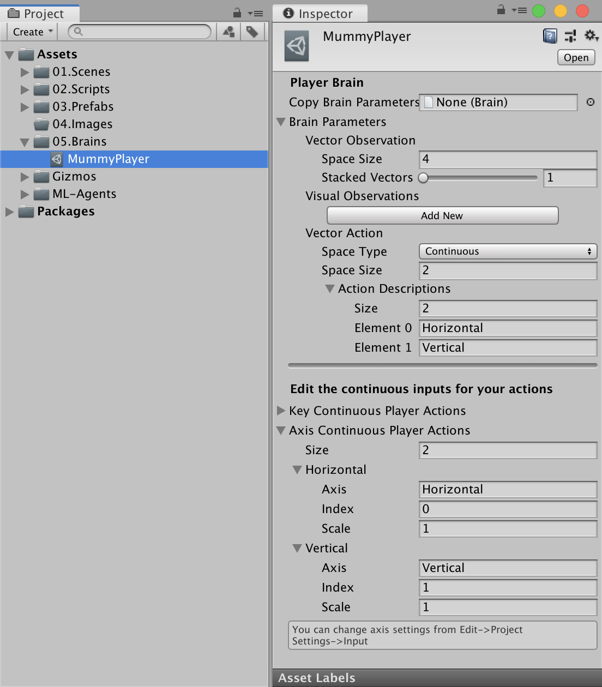
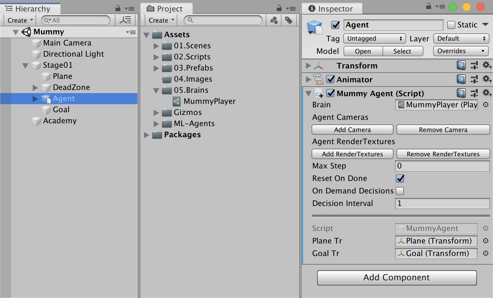
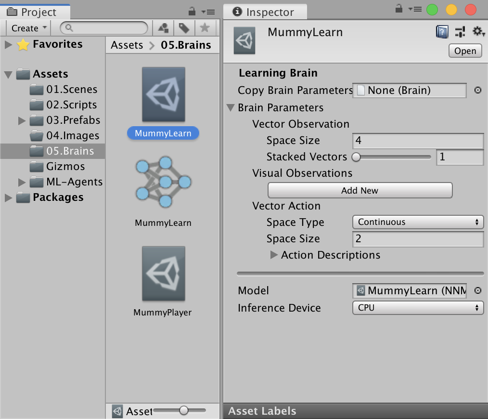

# ML-Agent 실습 워크북 1 - Mummy

## 프로젝트 생성 및 MLAgent 임포트

1. 새로운 프로젝트를 생성한다. (Project Name은 Mummy로 설정)

2. 프로젝트 뷰의 폴더는 다음과 같이 생성한다.



3. 유니티 MLAgent 깃허브 주소에서 최신 소스를 클론하거나 내려받는다. [ml-agent git](https://github.com/Unity-Technologies/ml-agents)

4. 내려받은 ml-agents/UnitySDK/Assets 폴더에 있는 Gizmos 폴더와 ML-Agents 폴더를 Mummy 프로젝트 뷰로 임포트한다.


5. 에셋스토어에서 Mummy로 검색해 다음 리소스를 내려받는다.


### 스테이지 생성

1. 빈 게임오브젝트를 생성한 후 이름을 Stage01로 지정한다. Transform.position을 (0, 0, 0)로 설정한다.
2. Stage01을 선택한 후 하위에 Cube를 추가한다. Cube의 이름을 Plane으로 변경한 후 Transform 속성을 다음과 같이 수정한다.

3. Plane의 머티리얼은 적절해 수정한다.(spawnVolumnMaterial)

4. 외곽에 4개의 Cube를 생성해 DeadZone을 생성한다. 
    - 추후 에이젼트가 닿았을 때 마이너스 보상을 준다. 
    - 배치를 끝낸 Cube의 MeshRenderer와 Mesh Filter 컴포넌트는 제거해 Box Collider만을 남겨둔다.
    - DeadZone의 Box Collider의 Is Trigger 속성을 체크한다.

5. Mummy_mom 모델을 Stage01 하위에 차일드화 시킨 후 이름을 Agent로 변경하고 머티리얼을 적용한다.

6. Agent의 Animator를 Mummy_Anim을 연결한다.

7. Mummy 모델에 Capsule Collider를 추가하고 radius를 0.3, Center/Y를 0.5로 설정한다. 또한, Is Trigger 속성도 체크한다.
8. Cube를 생성한 후 이름을 Goal로 수정하고 머티리얼을 설정한다.
    - Goal의 Transform.position은 (0, 0.5, 3)으로 설정한다.


## Academy 스크립트 작성

1. 빈 게임오브젝트를 생성한 후 이름을 Academy로 변경한다.
2. 02.Scripts 폴더에 MummyAcademy 스크립트를 작성한 후 Academy 게임오브젝트에 추가한다.
3. MummyAcademy 스크립트를 다음과 같이 수정한다.
    - MLAgents 네임스페이스를 추가
    - 베이스 클래스를 Academy로 지정
    - 기존 Start, Update 함수는 삭제
```cs
using System.Collections;
using System.Collections.Generic;
using UnityEngine;
using MLAgents;

public class MummyAcademy : Academy
{
}
```

4. 베이스 클래스를 Academy로 변경한 후에 다음과 같이 아카데미의 속성이 인스펙터 뷰에 표시된다.


## Brain 생성

브레인의 역할은 ? 

### Player 브레인 생성
Player 브레인은 개발자가 직접 조작하는 방식의 브레인으로 강화학습과는 관계없다. 테스트할 때 사용하는 용도로 사용하며, 추후 모방 학습에 활용할 수 있다.
1. 프로젝트 뷰의 05.Brains 폴더를 선택하고 Create -> ML-Agents -> Player Brain을 선택해 브레인을 생성한다. 브레인의 이름은 MummyPlayer로 설정한다.


## Agent 스크립트 작성

에이젼트는 주변 환경을 관찰하고 브레인에서 결정한 행동을 실행하는 역할을 한다. 에이젼트의 관찰 옵션을 어떻게 설정하느냐에 따라 학습 시간과 결과 도출에 큰 영향을 미치기 때문에 신중히 설계해야 한다. 새로운 MummyAgent 스크립트를 생성하고 다음과 같이 작성한다.

### InitializeAgent 함수

에이젼트가 초기화될 때 호출되는 함수로 각종 변수의 초기화 작업을 실행한다.

```cs
using UnityEngine;
//MLAgent 네임스페이스 추가
using MLAgents;

public class MummyAgent : Agent
{
    //바닥 모델의 Transform
    public Transform planeTr;
    //목표 모델의 Transform
    public Transform goalTr;

    //에이젼트 자신의 Transform
    private Transform mummyTr;

    //에이젼트가 초기화될때 호출되는 함수
    public override void InitializeAgent()
    {
        mummyTr = GetComponent<Transform>();
    }
}
```

### CollectObservations 함수
에이젼트가 주변환경을 관찰해 측정한 데이터를 브레인에 전달하는 기능을 정의한다. 브레인의 판단기준을 얼마만큼 잘 설정하는냐가 학습시간 또는 정확성이 결정된다.

```cs
using UnityEngine;
//MLAgent 네임스페이스 추가
using MLAgents;

public class MummyAgent : Agent
{
    //바닥 모델의 Transform
    public Transform planeTr;
    //목표 모델의 Transform
    public Transform goalTr;

    //에이젼트 자신의 Transform
    private Transform mummyTr;

    //에이젼트가 초기화될때 호출되는 함수
    public override void InitializeAgent()
    {
        mummyTr = GetComponent<Transform>();
    }

    //주변환경의 정보를 관찰(수집)해 브레인에 전달하는 함수
    public override void CollectObservations()
    {
        //#1 관측 정보
        //에이젼트와 바닥의 중앙간의 거리를 관측 : 바닥의 중앙으로 부터 멀리 떨어질수록 - 보상을 받을 가능성이 크기 때문
        Vector3 dist1 = planeTr.position - mummyTr.position;
        
        //관측한 데이터를 정규화(크기가 1.0으로 변경, 즉, -1.0 ~ 0.0 ~ 1.0)
        //바닥의 크기가 10.0f이지만 중앙을 기점으로의 거리는 0.0 ~ 5.0 사이의 값을 갖는다.
        //에이젼트는 x, z 평면으로만 이동하기에 y값은 관측하지 않는다.
        float norX1 = Mathf.Clamp(dist1.x / 5.0f, -1.0f, +1.0f);
        float norZ1 = Mathf.Clamp(dist1.z / 5.0f, -1.0f, +1.0f);

        //#2 관측 정보
        //에이전트와 목표물(Goal)간의 거리를 관측 : 목표물과 가까워 질수록 + 보상을 받을 가능성이 커지기 때문
        Vector3 dist2 = goalTr.position - mummyTr.position;

        //관측한 데이터 정규화
        //에이젼트와 목표물간의 떨어져 있는 최대거리는 바닥의 크기인 10과 동일하다.
        float norX2 = Mathf.Clamp(dist2.x / 10.0f, -1.0f, +1.0f);
        float norZ2 = Mathf.Clamp(dist2.z / 10.0f, -1.0f, +1.0f);

        //관측 데이터를 브레인에 전달
        AddVectorObs(norX1);
        AddVectorObs(norZ1);
        AddVectorObs(norX2);
        AddVectorObs(norZ2);
    }
}
```

### AgentAction 함수

브레인으로부터 결정되고 전달된 명령을 수행하고 수행 결과에 따라서 에이젼트에게 적절한 보상을 주는 기능을 구현하는 함수다.

```cs
using UnityEngine;
//MLAgent 네임스페이스 추가
using MLAgents;

public class MummyAgent : Agent
{
    //바닥 모델의 Transform
    public Transform planeTr;
    //목표 모델의 Transform
    public Transform goalTr;

    //에이젼트 자신의 Transform
    private Transform mummyTr;

#region MLAGENT_CALLBACK
    //에이젼트가 초기화될때 호출되는 함수
    public override void InitializeAgent()
    {
        mummyTr = GetComponent<Transform>();
    }

    //주변환경의 정보를 관찰(수집)해 브레인에 전달하는 함수
    public override void CollectObservations()
    {
        //#1 관측 정보
        //에이젼트와 바닥의 중앙간의 거리를 관측 : 바닥의 중앙으로 부터 멀리 떨어질수록 - 보상을 받을 가능성이 크기 때문
        Vector3 dist1 = planeTr.position - mummyTr.position;
        
        //관측한 데이터를 정규화(크기가 1.0으로 변경, 즉, -1.0 ~ 0.0 ~ 1.0)
        //바닥의 크기가 10.0f이지만 중앙을 기점으로의 거리는 0.0 ~ 5.0 사이의 값을 갖는다.
        //에이젼트는 x, z 평면으로만 이동하기에 y값은 관측하지 않는다.
        float norX1 = Mathf.Clamp(dist1.x / 5.0f, -1.0f, +1.0f);
        float norZ1 = Mathf.Clamp(dist1.z / 5.0f, -1.0f, +1.0f);

        //#2 관측 정보
        //에이전트와 목표물(Goal)간의 거리를 관측 : 목표물과 가까워 질수록 + 보상을 받을 가능성이 커지기 때문
        Vector3 dist2 = goalTr.position - mummyTr.position;

        //관측한 데이터 정규화
        //에이젼트와 목표물간의 떨어져 있는 최대거리는 바닥의 크기인 10과 동일하다.
        float norX2 = Mathf.Clamp(dist2.x / 10.0f, -1.0f, +1.0f);
        float norZ2 = Mathf.Clamp(dist2.z / 10.0f, -1.0f, +1.0f);

        //관측 데이터를 브레인에 전달
        AddVectorObs(norX1);
        AddVectorObs(norZ1);
        AddVectorObs(norX2);
        AddVectorObs(norZ2);
    }

    public override void AgentAction(float[] vectorAction, string textAction)
    {
        //에이젼트는 가로/세로 방향으로만 이동한다.
        //A,D (Horizontal)  --> vectorAction[0]을 통해서 전달
        //W,S (Vertical)    --> vectorAction[1]을 통해서 전달

        //브레인으로 부터 전달된 명령값
        float h = vectorAction[0];
        float v = vectorAction[1];

        //이동할 방향 벡터 계산
        Vector3 dir = (Vector3.forward * v) + (Vector3.right * h);
        //에이젼트 이동처리
        mummyTr.Translate(dir);

        //시간 패널티를 적용한다. 
        //시간이 흐를수록 - 보상이 누적되기 때문에 에이젼트가 계속 이동하는 것을 
        //유도하기 위함이다.
        //단, 아주 작은 값으로 적용해야한다.
        AddReward(-0.001f);
    }
#endregion

#region UNITY_CALLBACK

#endregion    
}
```

### Player Brain 설정

Player Brain은 플레이어가 직접 에이젼트에 명령을 내리는 것으로 주로 테스트용으로 사용한다. (추후 모방학습에 사용할 수 있다.) MummyPlayer 브레인의 속성을 다음과 같이 변경한다.

#### Brain Parameters/Vector Observation

**Space Size** : AddVectorObs의 갯수
MummyAgent의 CollectObservations함수에서 네개의 AddVectorObs 관측함수를 사용했기에 Space Size를 4로 설정한다. 즉, AddVectorObs의 갯수와 동일해야 한다.

#### Brain Parameters/Vector Action
    
**Space Type** : 명령 데이터의 타입
브레인에서 넘어오는 명령의 데이터 타입을 설정하는 옵션이다.

|**Space Type**|**설명**|
|-|-|
|Discrete|이산 : -1, 0, 1과 같이 전달하는 명령이 정확한 갯수로 정해진 경우|
|Continuous|연속 : -1.0, -0.9, -0.8,... 과 같이 연속적인 데이터로 명령을 전달할 경우|
    
**Vector Action** 
브레인의 명령 갯수로 Space Type을 Continuous로 설정했을 때 표시되는 옵션이다. MummyAgnet에 전달할 명령은 가로(Horizontal : A,D 키), 세로(Vertical : W, S 키) 2 종류이기에 Vector Action을 2로 설정한다.

#### Edit the continuous inputs for your actions
입력을 위한 특정 키 또는 Input클래스에 설정된 Axis를 설정한다.



### Agent 설정
하이러키 뷰의 Stage01/Agent를 선택한 후 MummyAgent 스크립트를 추가하고 다음 속성을 연결한다.

1. Brain 속성에는 프로젝트 뷰의 05.Brain/MummyPlayer 브레인을 연결한다.
2. Plane Tr 속성에는 하이러키 뷰의 Stage01/Plane을 연결한다.
3. Goal Tr 속성에는 하이러키 뷰의 Stage01/Goal을 연결한다.



유니티를 실행해 화살표키로 Mummy를 전후좌우 이동하는지 확인한다.

## MummyAgent 스크립트 수정

DeadZone 또는 Goal과 충돌 판별에 필요한 태그를 다음과 같이 생성한다.

    - GOAL
    - DEAD_ZONE

1. 하이러키 뷰의 Stage01/Goal의 태그를 GOAL로 지정
2. 하이러키 뷰의 Stage01/DeadZone/Cube ... 의 태그를 DEAD_ZONE으로 지정

### AddReward

에이젼트가 Dead Zone과 충돌시 마이너스 보상을 주고 목표물(Goal)에 도착하면 +1 보상을 준다.

```cs
using UnityEngine;
//MLAgent 네임스페이스 추가
using MLAgents;
using System;
using Random = UnityEngine.Random;

public class MummyAgent : Agent
{
    //바닥 모델의 Transform
    public Transform planeTr;
    //목표 모델의 Transform
    public Transform goalTr;

    //에이젼트 자신의 Transform
    private Transform mummyTr;

    //상태에 따라 바닥의 색상 변경
    public Material goalMat;
    public Material deadMat;
    
    private Material originMat;
    private Material material;

#region MLAGENT_CALLBACK
    //에이젼트가 초기화될때 호출되는 함수
    public override void InitializeAgent()
    {
        mummyTr = GetComponent<Transform>();
        material = planeTr.GetComponent<MeshRenderer>().material;
        originMat = material;
    }

    //주변환경의 정보를 관찰(수집)해 브레인에 전달하는 함수
    public override void CollectObservations()
    {
        //#1 관측 정보
        //에이젼트와 바닥의 중앙간의 거리를 관측 : 바닥의 중앙으로 부터 멀리 떨어질수록 - 보상을 받을 가능성이 크기 때문
        Vector3 dist1 = planeTr.position - mummyTr.position;
        
        //관측한 데이터를 정규화(크기가 1.0으로 변경, 즉, -1.0 ~ 0.0 ~ 1.0)
        //바닥의 크기가 10.0f이지만 중앙을 기점으로의 거리는 0.0 ~ 5.0 사이의 값을 갖는다.
        //에이젼트는 x, z 평면으로만 이동하기에 y값은 관측하지 않는다.
        float norX1 = Mathf.Clamp(dist1.x / 5.0f, -1.0f, +1.0f);
        float norZ1 = Mathf.Clamp(dist1.z / 5.0f, -1.0f, +1.0f);

        //#2 관측 정보
        //에이전트와 목표물(Goal)간의 거리를 관측 : 목표물과 가까워 질수록 + 보상을 받을 가능성이 커지기 때문
        Vector3 dist2 = goalTr.position - mummyTr.position;

        //관측한 데이터 정규화
        //에이젼트와 목표물간의 떨어져 있는 최대거리는 바닥의 크기인 10과 동일하다.
        float norX2 = Mathf.Clamp(dist2.x / 10.0f, -1.0f, +1.0f);
        float norZ2 = Mathf.Clamp(dist2.z / 10.0f, -1.0f, +1.0f);

        //관측 데이터를 브레인에 전달
        AddVectorObs(norX1);
        AddVectorObs(norZ1);
        AddVectorObs(norX2);
        AddVectorObs(norZ2);
    }

    public override void AgentAction(float[] vectorAction, string textAction)
    {
        //에이젼트는 가로/세로로만 이동한다.
        //A,D (Horizontal)  --> vectorAction[0]을 통해서 전달
        //W,S (Vertical)    --> vectorAction[1]을 통해서 전달

        //브레인으로 부터 전달된 명령값
        float h = vectorAction[0];
        float v = vectorAction[1];

        //이동할 방향 벡터 계산
        Vector3 dir = (Vector3.forward * v) + (Vector3.right * h);
        //에이젼트 이동처리
        mummyTr.Translate(dir);

        //시간 패널티를 적용한다. 
        //시간이 흐를수록 - 보상이 누적되기 때문에 에이젼트가 계속 이동하는 것을 
        //유도하기 위함이다. 단, 아주 작은 값으로 적용해야한다.
        AddReward(-0.001f);
    }

    //Agent가 리셋될 때 호출되는 함수
    public override void AgentReset()
    {
        ResetState();
    }
#endregion

#region UNITY_CALLBACK

    void OnTriggerEnter(Collider coll)
    {
        if (coll.CompareTag("GOAL"))
        {
            planeTr.GetComponent<MeshRenderer>().material = goalMat;
            //목표물에 도착했기에 +1 보상을 준다.
            AddReward(1.0f);

            //스테이지를 초기화하고 학습한다.
            ResetState();
        }
        if (coll.CompareTag("DEAD_ZONE"))
        {
            planeTr.GetComponent<MeshRenderer>().material = deadMat;
            //에이젼트가 사망했기에 -1 보상을 준다.
            AddReward(-1.0f);
            
            //에이젼트 스크립트의 Reset On Done 속성이 체크되어 있으면 AgentReset 함수가 자동으로 발생
            Done();
        }
    }

    private void ResetState()
    {
        //에이젼트 위치 초기화
        mummyTr.localPosition = new Vector3(0.0f, 0.05f, 0.0f);

        //목표물의 불규칙한 위치 계산
        Vector3 pos = new Vector3(Random.Range(-4.0f, 4.0f), 0.5f, Random.Range(-4.0f, 4.0f));
        goalTr.localPosition = pos;

        //원래 머티리얼로 변경
        Invoke("SetNormalMat", 0.3f);
    }

    void SetNormalMat()
    {
        planeTr.GetComponent<MeshRenderer>().material = originMat;
    }
#endregion
}
```

### Mummy에 충돌 발생을 위한 컴포넌트 추가

충돌 콜백함수의 발생을 위해 Mummy에 Capsule Collider, Rigidbody 컴포넌트를 추가한다.

|**컴포넌트**|**속성**|**설정값**|
|-|-|-|
|Capsule Collider|Is Trigger|체크||
||Radius|0.3|
||Center Y|0.5|
|Rigidbody|Is Kinematic|체크|


### 보상 상태에 따른 바닥색상 변경

목표물에 도달하거나 사망했을 때의 상태를 바닥의 색상으로 표시한다.
goalMat : 목표물에 도달했을 때 변경할 머티리얼 연결
deadMat : 사망했을 때 변경할 머티리얼 연결

```cs
    //상태에 따라 바닥의 색상 변경
    public Material goalMat;
    public Material deadMat;
    
    private Material originMat;
    private Material material;

#region MLAGENT_CALLBACK
    //에이젼트가 초기화될때 호출되는 함수
    public override void InitializeAgent()
    {
        mummyTr = GetComponent<Transform>();
        material = planeTr.GetComponent<MeshRenderer>().material;
        originMat = material;
    }
```

```cs
    void OnTriggerEnter(Collider coll)
    {
        if (coll.CompareTag("GOAL"))
        {
            planeTr.GetComponent<MeshRenderer>().material = goalMat;
            //목표물에 도착했기에 +1 보상을 준다.
            AddReward(1.0f);

            //스테이지를 초기화하고 학습한다.
            ResetState();
        }
        if (coll.CompareTag("DEAD_ZONE"))
        {
            planeTr.GetComponent<MeshRenderer>().material = deadMat;
            //에이젼트가 사망했기에 -1 보상을 준다.
            AddReward(-1.0f);
            
            //에이젼트 스크립트의 Reset On Done 속성이 체크되어 있으면 AgentReset 함수가 자동으로 발생
            Done();
        }
    }
```


## Academy에 브레인 연결


# Learning Brain 생성

Player Brain으로 컨트롤했을 때 정상적으로 동작했다면 Learnig Brain으로 학습을 시켜야 한다. Learning Brain을 생성한 후 Copy Brain Parameter 속성에 기존에 만들었던 MummyPlayer 브레인을 연결하면 기존에 설정했던 파라미터가 자동으로 설정된다.



1. 하이러키뷰의 Academy를 선택한 후 Broadcast Hub의 [Add New] 버튼을 클릭한 후 추가된 Brains에 MummyLearn 프레인을 연결한다. LearningBrain의 경우 우측에 Control옵션을 체크한다. 