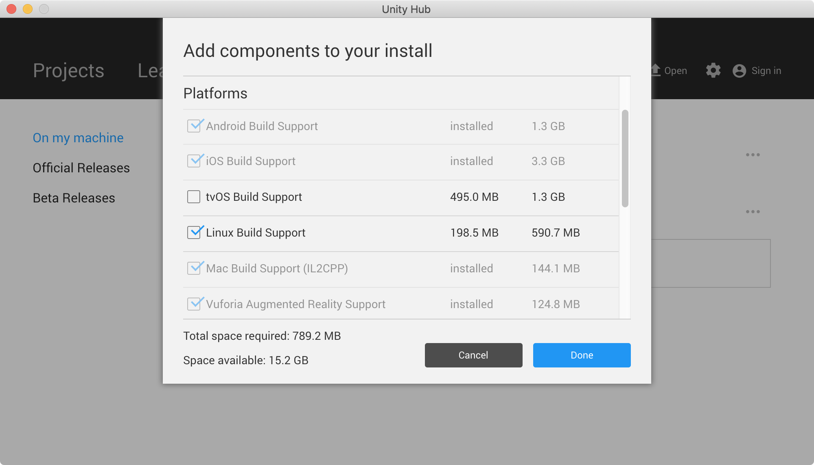
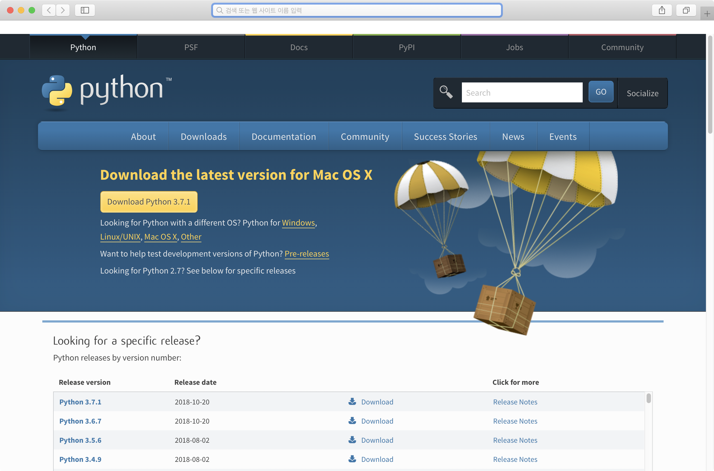
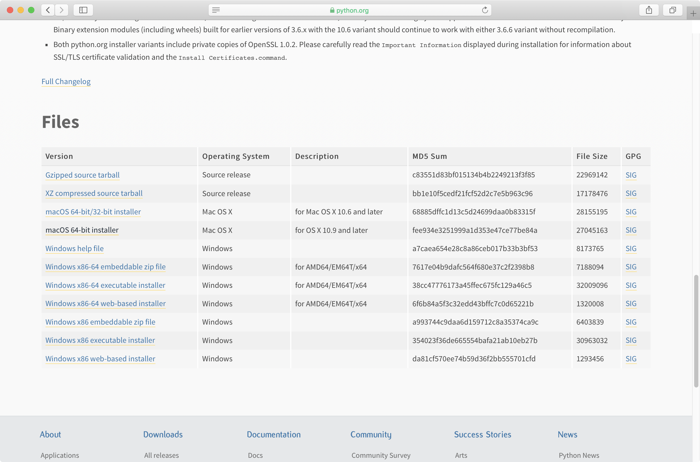

# 머신러닝(Machine Learning)


<!--  -->

## 머신러닝의 정의

### 머신러닝(Machine Learning)의 어원

>**"Field of study that gives computers the ability to learn without being explicitly programmed" - 아더 사무엘(Arthur Samuel 1959)**

### 머신러닝 vs 딥러닝

머신러닝은 **데이터에서 법칙성을 추출하는 통계적 방법**을 의미한다. 
(참고: 파이선으로 배우는 머신러닝 교과서)

머신러닝의 응용 예는 손글씨 문자 식별, 얼굴 인식, 물체의 식별등에서 찾아볼수 있다. 딥 러닝은 머신러닝의 한 부분으로서 인간 두뇌의 신경세포(시넵스)를 모방한 신경망 모델을 말한다. 

머신러닝과 딥 러닝은 모두 인공지능(Artificial Intellgence)의 범위에 포함되는 개념이다.


[출처: https://dxchange.io/blogs/artificial-intelligence](https://dxchange.io/blogs/artificial-intelligence)

## 머신러닝의 분류

### **지도 학습(Supervised Learning)** 
미리 제공한 정보를 바탕으로 학습을 통해 모델을 생성한 후 주어진 문제를 추론(예측)하는 방법이다. 이때 제공된 정보를 트레이닝 데이터(트레이닝 데이터 셋)라 한다. 또한, 제공되는 트레이닝 데이터 셋은 각각 그 데이터가 무엇인지 알려주는 정보를 레이블(Label)이라 한다.

- 트레이닝 데이터 셋(Training Data Set) : 학습을 위한 자료의 집합
- 레이블(Label) : cat, dog, mug, hat


[출처: http://cs231n.github.io/classification/](http://cs231n.github.io/classification/)



[참고 : EDA(Exploratory Data Analysis) 탐색적 데이터 분석](https://eda-ai-lab.tistory.com/13)

### **비지도 학습(Unsupervised Learning)** 
아무런 정보를 제공하지 않고 정답을 추론하는 방법이다. 이 학습법은 많은 수의 데이터를 검사해 각각의 유사성(특징)에 기초해 분류한다. 하지만 레이블이 제공되지 않기 때문에 무엇인지는 인지할 수 없고 분류(Classification)만 한다.


### **강화 학습(Reinforcement Learning)**
반복 훈련(시행착오)을 통해 행동에 대한 보상을 기반으로 올바른 해를 구하면 + 보상(Reward)을 주고 틀린 해를 구하면 - 보상을 주는 방법으로 가장 최상의 결과를 찾는 학습법 (예: 알파고(DQN))


----

# 머신러닝의 기초 - 지도학습(Supervised Learning)

## 지도학습의 분류

|분류|설명|
|-|-|
|Regression|연속적인 트레이닝 데이터에 기초헤 정답을 추론하는 방법|
|Binary classification|2개의 레이블로 이루어진 트레이닝 데이터에 기초해 정답을 추론하는 방법|
|Multi-label classification|다수의 레이블로 이루어진 트레이닝 데이터에 기초해 정답을 추론하는 방법|


- **Regression** 
  
  예) 공부한 시간에 따른 시험 점수를 예측

  |시간(X)|점수(Y)|
  |-|-|
  |10|90|
  |9|80|
  |3|50|
  |2|30|

- **Binary classification**
  
  예) 공부한 시간에 따라 패스했는지 실패했는지 둘 중 하나를 예측

  |시간(X)|패스여부(Y)|
  |-|-|
  |10|P|
  |9|P|
  |3|F|
  |2|F|

- **Multi-lable classification** : 

  공부한 시간에 따른 특정 과목의 학점(A, B, C, D, F)을 예측

  |시간(X)|학점(Y)|
  |-|-|
  |10|A|
  |9|B|
  |3|C|
  |2|F|

## 선형회귀(Linear Regression)

선형회귀는 일련의 데이터(X)의 실제값(Y)이 있는 트레이닝 데이터를 기반으로 특정 값에 대한 결괏값을 추론하는 기법이다. 예를 들어 다음 표와 같이 학습한 시간에 따른 시험 점수의 데이터를 활용해 학습한 후 특정 시간(X)을 공부했을 때 몇점의 점수를 받을 수 있을지를 예측할 때 사용하는것을 Regression 알고리즘이다.

|시간(X)|점수(Y)|
|-|-|
|10|90|
|9|80|
|5|60|
|3|50|
|2|30|




<!--
#%%

import tensorflow as tf
import matplotlib.pyplot as plt

x_data = [2,3,5,9,10]       #시간(X)
y_data = [30,50,60,80,90]   #점수(Y)

plt.plot(x_data, y_data, "ro")
plt.xlabel("x=time")
plt.ylabel("y=score")
plt.plot([2,10],[30,90])

plt.show()
-->

### 가설 (Hypothesis)

**선형회귀**란 실제로 계산된(제시된)점들과 가장 가까운 임의의 **직선**을 찾는 알고리즘을 말한다. 따라서 실측된 데이터에 가장 근접하는 직선을 찾기 위해 먼저 가설를 세운다.



  가설은 다음과 같이 일차 방정식으로 표현할 수 있다.

  =W(x)+b)

### Cost/Loss Function
    
- 예측값과 실제값의 차이

    -y)
    
    단순한 차이를 계산했지만 음수가 나올 수 있기 때문에 제곱한다.

    -y)^2)

    모든 오차값의 합계를 계산
    
    -y^{1})+H((x^{2})-y^{2})+...+H((x^{m})-y^{m})}{m})

    수학적인 기호로 변환

    -y^i)^2)

    따라서 Cost/Loss Function은 모든 오차의 합계를 의미한다.

# 머신러닝 개발환경 구축

### [윈도우OS 개발환경 설정](http://www.github.com/indiegamemaker/ml_install)

<!--
# 머신러닝 개발환경 구축

- 파이썬(Python) : 파이썬은 3.6 버전을 설치한다. 3.7 버전을 지원하지 않는다.
- numpy 설치

```sh
[zackiller-bash]$ pip3 install numpy
```

- matplotlib 설치
```
[zackiller-bash]$ pip3 install matplotlib
```

### 주피터 노트북(Jupyter Notebook)

파이썬의 편집기로 데이터 분석에 편리한 특징을 갖고 있다. 
[다운로드](http://jupyter.org)

### 넘파이(Numpy)

#### arange(a, b, s)
a 와 b-1 사이를 s 간격의 배열값을 반환한다.

```python
import numpy as np
x = np.arange(-2, 2, 0.5)
print(x)

[-2.  -1.5 -1.  -0.5  0.   0.5  1.   1.5]
```

#### linspace(a, b, n)

a와 b 사이의 값을 n개의 간격으로 나눈값을 배열로 반환한다.

```python
import numpy as np
x = np.linspace(-2, 2, 10)
print(np.round(x,2))

[-2.   -1.56 -1.11 -0.67 -0.22  0.22  0.67  1.11  1.56  2.  ]
```

#### mpl_toolkits.mplot3d

3차원 입체 그래프를 표시하기 위한 라이브러리다. [Mplot3d](https://matplotlib.org/mpl_toolkits/index.html)


```python
from pylab import *

x = linspace(-1.6, 1.6, 10000)
f = lambda x: (sqrt(cos(x)) * cos(200 * x) + sqrt(abs(x)) - 0.7) * \
    pow((4 - x * x), 0.01)
plot(x, list(map(f, x)))
show()
```

^2)

-->

